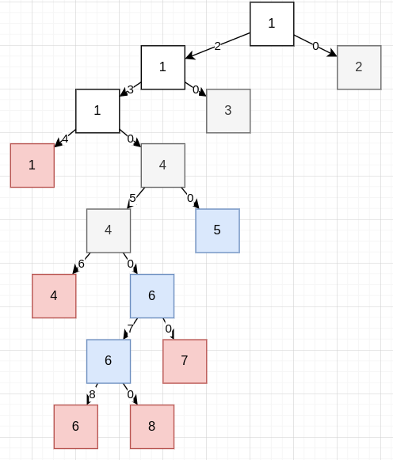

# Title
# Ch5 -- 进程

## 实践

1. 进程创建 `posix_spawn`

比 `fork() + exec()` 简单得多, 核心代码只要这些就可以了:

```rust
// os/src/task/task.rs

impl TaskControlBlock {
    /// spawn a new process with elf data `app_elf`
    pub fn spawn(self: &Arc<Self>, app_elf: &[u8])-> Arc<Self> {
        // 由 ELF 数据段创建一个空进程 ret
        let ret = Arc::new(Self::new(app_elf));
        // 把 ret 连接到父进程上
        ret.inner_exclusive_access().parent = Some(Arc::downgrade(&self));
        self.inner_exclusive_access().children.push(ret.clone());
        // 完毕
        ret
    }
}
```

此外，本人还计划在 EDF, EEVDF, stride 等调度算法中选 1 个在 ch5 分支上实现.

## 问答

1. fork + exec 的一个比较大的问题是 fork 之后的内存页/文件等资源完全没有使用就废弃了，针对这一点，有什么改进策略？

- 像 Linux 一样为 fork() 做页面 CoW 优化, 减少浪费.
- 使用 spawn() 系统调用. Windows NT 上的类似物是 CreateProcess(), POSIX 规范的类似物是 posix_spawn(). spawn() 系统调用可以直接 new 一个任务而不是拷贝原有的, 连创建都没有，就没有废弃了.

3. 请阅读下列代码，并分析程序的输出，假定不发生运行错误，不考虑行缓冲...如果 fork() 之后主程序先运行，则结果如何？如果 fork() 之后 child 先运行，则结果如何？

- 主程序先运行: `01342`
- 子程序先运行: `03412`

4. 阅读下列代码，分析程序的输出 A 的数量.



由图得 n(A) = 1 + 3 + 3x2 + 3x2x2 = 22.
